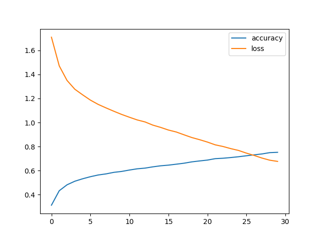

# Emotions Detector

Computer vision project.  
Based on a Convolutional Neural Network.

My model (mymodel.pkl) has been trained on the FER-2013 dataset, consisting of:  
  - 28.709 train images
  - 7.178 test images

Scattered among 7 different classes: Angry / Disgust / Fear / Happy / Neutral / Sad / Surprise

The dataset is the FER-2013 dataset available on Kaggle.
https://www.kaggle.com/datasets/msambare/fer2013

---

For inference, I am using opencv-python and a VideoCapture object, then turning the captured image into grayscale and resizing it to a 48x48 dimension (image dimensions in the FER-2013 dataset).

Loss function was CrossEntropy.  
The optimizer was the Adam optimizer with a learning rate of 0.0003.  

The model has been trained on kaggle with the emotions.ipynb notebook file. Feel free to explore it !

Learning curves : 

